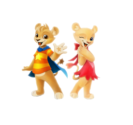

### 소개

팀프로젝트로 맡은 리뉴얼 프로젝트입니다.

에버랜드의 메인 홈페이지를 리뉴얼하였습니다.

### 개발환경

> Windows 10
> 

> Visual Studio Code

### 팀원

임채민|👽홍민경|김도예|김주선
-|-|-|-
팀장|개발팀장|디자인담당|개발보조

### 사용언어

### 플러그인

> Swiper
> 

> fullpage.js
> 

> kakao nest API
>

